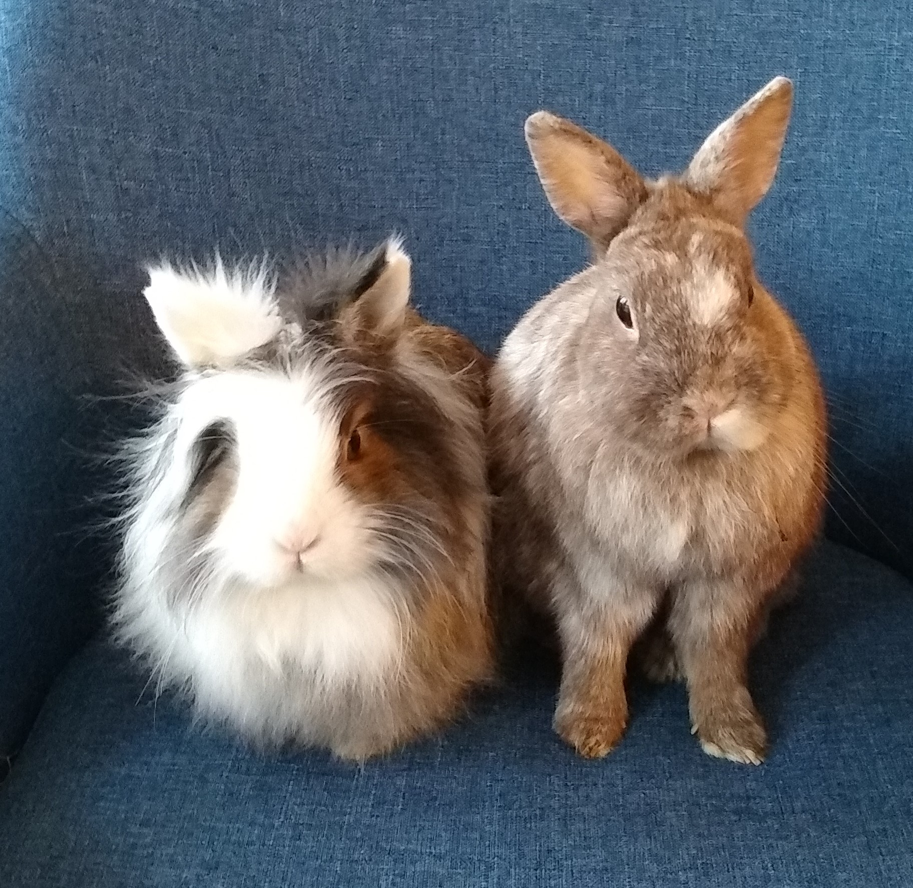

---

marp: true
enableHtml: true
__theme: gaia
class: invert
paginate: true
_paginate: false

---

<!-- <h1 style='color:white; font-size: 170%'>hop: a language to design function-overload-sets</h1>
lightning talk - Tobias Loew -->
homogenous variadic functions -  a lightning-library approach in 12 sec/LOC
Tobias Loew - lightning talk

come down with me into the rabbit hole!

<!-- 
<h2>come and hop with me!</h2>
 -->

---
<!--header: ' '-->

 bunnies love tunnels      

---
<!--header: ' '-->

 bunnies love tunnels cycle very fast     

---
<!--header: ' '-->

 bunnies love tunnels cycle very fast travel back in time    

---
<!--header: ' '-->

 bunnies love tunnels cycle very fast travel back in time fix C++ right from the start   

---
<!--header: ' '-->

 bunnies love tunnels cycle very fast travel back in time fix C++ right from the start and we're done!  

---
<!--header: ''-->

back to our timeline...

---
<!--header: ''-->
 
# homogeneous variadic function (HVF)
- function (overload-set) with an arbitrary number of arguments, all of the same type <pre style="_font-size:100%"><code>foo(T&nbsp;t1); foo(T&nbsp;t1,&nbsp;T&nbsp;t2); foo(T&nbsp;t1,&nbsp;T&nbsp;t2,&nbsp;T&nbsp;t3); foo(T&nbsp;t1,&nbsp;T&nbsp;t2,&nbsp;T&nbsp;t3,&nbsp;T&nbsp;t4); ... </code></pre>
- proposal for language support (P1219R2): <code>foo(T...&nbsp;ts)</code> - buried in Belfast 2019

---
<!--header: ' '-->

## C++20 best-practice: parameter pack + requires

<pre style="_font-size:100%"><code>template&nbsp;&lt;class...&nbsp;Args&gt; requires &nbsp;&nbsp;&nbsp;&nbsp;(is_convertible_v&lt;Args,&nbsp;T&gt;&nbsp;&amp;&amp;&nbsp;...)&nbsp;&nbsp;//&nbsp;all&nbsp;args&nbsp;are&nbsp;convertible&nbsp;to&nbsp;T void&nbsp;foo(Args&amp;&amp;...&nbsp;args) {&nbsp;/*...*/&nbsp;} </code></pre>

- pros
    - works for any number of arguments
    - matches only valid input
- cons
    - none (so far)

---

<!--header: ' '-->

## overload-resolution

HVFs for `int` and `float`
<pre style="_font-size:100%"><code>template&nbsp;&lt;class...&nbsp;Args&gt; requires &nbsp;&nbsp;&nbsp;&nbsp;(is_convertible_v&lt;Args,&nbsp;int&gt;&nbsp;&amp;&amp;&nbsp;...)&nbsp;&nbsp;&nbsp;&nbsp;//&nbsp;int&nbsp;args void&nbsp;foo(Args&amp;&amp;...&nbsp;args)&nbsp;{}   template&nbsp;&lt;class...&nbsp;Args&gt; requires &nbsp;&nbsp;&nbsp;&nbsp;(is_convertible_v&lt;Args,&nbsp;float&gt;&nbsp;&amp;&amp;&nbsp;...)&nbsp;&nbsp;//&nbsp;float&nbsp;args void&nbsp;foo(Args&amp;&amp;...&nbsp;args)&nbsp;{} </code></pre>

<pre><code>foo(1,&nbsp;2,&nbsp;3);&nbsp;&nbsp;&nbsp;&nbsp;&nbsp;//&nbsp;(a) foo(0.5f,&nbsp;-2.4f);&nbsp;//&nbsp;(b) foo(1.5f,&nbsp;3);&nbsp;&nbsp;&nbsp;&nbsp;&nbsp;//&nbsp;(c) </code></pre>

which overload of <code>foo</code> is called?

---
<!--header: ' '-->

---
<!--header: ''-->

let's ask the compiler <a href="https://godbolt.org/z/rEja84djj" target="_blank">overload test @ godbolt.org/z/rEja84djj</a>

---
<!--header: ''-->

## concepts won't help!

--- 

<!--header: ' '-->
## merge overloaded HVFs 

1. put types into `mp_list`
2. generate homogenous test-functions with call's arity
3. run built-in overload resolution
3. report selected type to the user (fail on ambiguity)

hey Jon look: __Boost.MP11__ is used!

<a href="https://godbolt.org/z/bj1n51fWf" target="_blank">HVF-library @ godbolt.org/z/bj1n51fWf</a>
  

visit [github.com/tobias-loew/hop](https://github.com/tobias-loew/hop)

---
<!--header: ' '-->

# that's all rodents!

visit [github.com/tobias-loew/hop](https://github.com/tobias-loew/hop)

and let's hop together!

